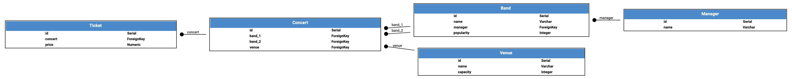

Included Apps
=============

Just as you can modularise your own code using :ref:`apps<PiccoloApps>`, Piccolo itself
ships with several builtin apps, which provide a lot of its functionality.

-------------------------------------------------------------------------------

Auto includes
-------------

The following are registered with your :ref:`AppRegistry<AppRegistry>` automatically.

.. hint:: To find out more about each of these commands you can use the
    ``--help`` flag on the command line. For example ``piccolo app new --help``.

-------------------------------------------------------------------------------

app
~~~

Lets you create new Piccolo apps. See :ref:`PiccoloApps`.

.. code-block:: bash

    piccolo app new

-------------------------------------------------------------------------------

asgi
~~~~

Lets you scaffold an ASGI web app. See :ref:`ASGICommand`.

.. code-block:: bash

    piccolo asgi new

-------------------------------------------------------------------------------

fixtures
~~~~~~~~

Fixtures are used when you want to seed your database with essential data (for
example, country names).

Once you have created a fixture, it can be used by your colleagues when setting
up an application on their local machines, or when deploying to a new
environment.

Databases such as Postgres have inbuilt ways of dumping and restoring data
(via ``pg_dump`` and ``pg_restore``), however they use binary files, which
aren't suitable for source control. Also, when dumping and restoring data, the
databases need to be running the same version of Postgres, which occasionally
is problematic.

To dump the data into a new fixture file:

.. code-block:: bash

    piccolo fixtures dump > fixtures.json

By default, the fixture contains data from all apps and tables. You can specify
a subset of apps and tables instead, for example:

.. code-block:: bash

    piccolo fixtures dump --apps=blog --tables=Post > fixtures.json

    # Or for multiple apps / tables
    piccolo fixtures dump --apps=blog,shop --tables=Post,Product > fixtures.json

To load the fixture:

.. code-block:: bash

    piccolo fixtures load fixtures.json

-------------------------------------------------------------------------------

meta
~~~~

Tells you which version of Piccolo is installed.

.. code-block:: bash

    piccolo meta version

-------------------------------------------------------------------------------

migrations
~~~~~~~~~~

Lets you create and run migrations. See :ref:`Migrations`.

-------------------------------------------------------------------------------

playground
~~~~~~~~~~

Lets you learn the Piccolo query syntax, using an example schema. See
:ref:`Playground`.

.. code-block:: bash

    piccolo playground run

-------------------------------------------------------------------------------

project
~~~~~~~

Lets you create a new ``piccolo_conf.py`` file. See :ref:`PiccoloProjects`.

.. code-block:: bash

    piccolo project new

.. _SchemaApp:

-------------------------------------------------------------------------------

schema
~~~~~~

generate
^^^^^^^^

Lets you auto generate Piccolo ``Table`` classes from an existing database.
Make sure the credentials in ``piccolo_conf.py`` are for the database you're
interested in, then run the following:

.. code-block:: bash

    piccolo schema generate > tables.py

.. warning:: This feature is still a work in progress. However, even in it's
    current form it will save you a lot of time. Make sure you check the
    generated code to make sure it's correct.

graph
^^^^^

A basic schema visualisation tool. It prints out the contents of a GraphViz dot
file representing your schema.

.. code-block:: bash

    piccolo schema graph

You can pipe the output to your clipboard (``piccolo schema graph | pbcopy``
on a Mac), then paste it into a `website like this <https://dreampuf.github.io/GraphvizOnline>`_
to turn it into an image file.

Or if you have `Graphviz <https://graphviz.org/download/>`_ installed on your
machine, you can do this to create an image file:

.. code-block:: bash

    piccolo schema graph | dot -Tpdf -o graph.pdf

Here's an example of a generated image:

-------------------------------------------------------------------------------

shell
~~~~~

Launches an iPython shell, and automatically imports all of your registered
``Table`` classes. It's great for running adhoc database queries using Piccolo.

.. code-block:: bash

    piccolo shell run

-------------------------------------------------------------------------------

sql_shell
~~~~~~~~~

Launches a SQL shell (``psql`` or ``sqlite3`` depending on the engine), using
the connection settings defined in ``piccolo_conf.py``. It's convenient if you
need to run raw SQL queries on your database.

.. code-block:: bash

    piccolo sql_shell run

For it to work, the underlying command needs to be on the path (i.e. ``psql``
or ``sqlite3`` depending on which you're using).

-------------------------------------------------------------------------------

.. _TesterApp:

tester
~~~~~~

Launches `pytest <https://pytest.org/>`_ , which runs your unit test suite. The
advantage of using this rather than running ``pytest`` directly, is the
``PICCOLO_CONF`` environment variable will automatically be set before the
testing starts, and will be restored to it's initial value once the tests
finish.

.. code-block:: bash

    piccolo tester run

Setting the :ref:`PICCOLO_CONF<PICCOLO_CONF>` environment variable means your
code will use the database engine specified in that file for the duration of
the testing.

By default ``piccolo tester run`` sets ``PICCOLO_CONF`` to
``'piccolo_conf_test'``, meaning that a file called ``piccolo_conf_test.py``
will be imported.

If you prefer, you can set a custom ``PICCOLO_CONF`` value:

.. code-block:: bash

    piccolo tester run --piccolo_conf=my_custom_piccolo_conf

You can also pass arguments to pytest:

.. code-block:: bash

    piccolo tester run --pytest_args="-s foo"

-------------------------------------------------------------------------------

Optional includes
-----------------

These need to be explicitly registered with your :ref:`AppRegistry<AppRegistry>`.

user
~~~~

Provides a user table, and commands for creating / managing users. See
:ref:`Authentication`.
