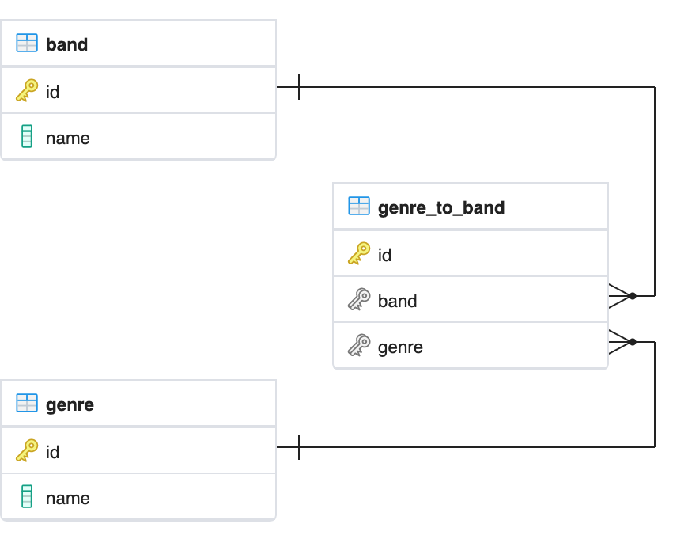

.. currentmodule:: piccolo.columns.m2m

###
M2M
###

.. note::

   There is a `video tutorial on YouTube <https://youtu.be/J9YFt8Hxm4I>`_.

Sometimes in database design you need `many-to-many (M2M) <https://en.wikipedia.org/wiki/Many-to-many_(data_model)>`_
relationships.

For example, we might have our ``Band`` table, and want to describe which genres of music
each band belongs to (e.g. rock and electronic). As each band can have multiple genres, a ``ForeignKey``
on the ``Band`` table won't suffice. Our options are using an ``Array`` / ``JSON`` / ``JSONB``
column, or using an ``M2M`` relationship.

Postgres and SQLite don't natively support ``M2M`` relationships - we create
them using a joining table which has foreign keys to each of the related tables
(in our example, ``Genre`` and ``Band``).

We create it in Piccolo like this:

.. code-block:: python

    from piccolo.columns.column_types import (
        ForeignKey,
        LazyTableReference,
        Varchar
    )
    from piccolo.columns.m2m import M2M
    from piccolo.table import Table

    class Band(Table):
        name = Varchar()
        genres = M2M(LazyTableReference("GenreToBand", module_path=__name__))

    class Genre(Table):
        name = Varchar()
        bands = M2M(LazyTableReference("GenreToBand", module_path=__name__))

    # This is our joining table:
    class GenreToBand(Table):
        band = ForeignKey(Band)
        genre = ForeignKey(Genre)

.. note::
    We use :class:`LazyTableReference <piccolo.columns.reference.LazyTableReference>`
    because when Python evaluates ``Band`` and ``Genre``, the ``GenreToBand``
    class doesn't exist yet.

By using ``M2M`` it unlocks some powerful and convenient features.

-------------------------------------------------------------------------------

Select queries
==============

If we want to select each band, along with a list of genres that they belong to,
we can do this:

.. code-block:: python

    >>> await Band.select(Band.name, Band.genres(Genre.name, as_list=True))
    [
        {"name": "Pythonistas", "genres": ["Rock", "Folk"]},
        {"name": "Rustaceans", "genres": ["Folk"]},
        {"name": "C-Sharps", "genres": ["Rock", "Classical"]},
    ]

You can request whichever column you like from the related table:

.. code-block:: python

    >>> await Band.select(Band.name, Band.genres(Genre.id, as_list=True))
    [
        {"name": "Pythonistas", "genres": [1, 2]},
        {"name": "Rustaceans", "genres": [2]},
        {"name": "C-Sharps", "genres": [1, 3]},
    ]

You can also request multiple columns from the related table:

.. code-block:: python

    >>> await Band.select(Band.name, Band.genres(Genre.id, Genre.name))
    [
        {
            'name': 'Pythonistas',
            'genres': [
                {'id': 1, 'name': 'Rock'},
                {'id': 2, 'name': 'Folk'}
            ]
        },
        ...
    ]

If you omit the columns argument, then all of the columns are returned.

.. code-block:: python

    >>> await Band.select(Band.name, Band.genres())
    [
        {
            'name': 'Pythonistas',
            'genres': [
                {'id': 1, 'name': 'Rock'},
                {'id': 2, 'name': 'Folk'}
            ]
        },
        ...
    ]

As we defined ``M2M`` on the ``Genre`` table too, we can get each band in a
given genre:

.. code-block:: python

    >>> await Genre.select(Genre.name, Genre.bands(Band.name, as_list=True))
    [
        {"name": "Rock", "bands": ["Pythonistas", "C-Sharps"]},
        {"name": "Folk", "bands": ["Pythonistas", "Rustaceans"]},
        {"name": "Classical", "bands": ["C-Sharps"]},
    ]

Bidirectional select queries
----------------------------

The ``bidirectional`` argument is **only** used for self-referencing tables
in many to many relationships. If set to ``True``, a bidirectional
query is performed to obtain the correct result in a symmetric
many to many relationships on self-referencing tables.

.. code-block:: python

    class Member(Table):
        name = Varchar()
        # self-reference many to many
        followers = M2M(
            LazyTableReference("MemberToFollower", module_path=__name__)
        )
        followings = M2M(
            LazyTableReference("MemberToFollower", module_path=__name__)
        )

    class MemberToFollower(Table):
        follower_id = ForeignKey(Member)
        following_id = ForeignKey(Member)

    >>> await Member.select(
            Member.followers(Member.name, as_list=True, bidirectional=True)
        ).where(Member.name == "Bob")
    [{"followers": ["Fred", "John", "Mia"]}]

-------------------------------------------------------------------------------

Objects queries
===============

Piccolo makes it easy working with objects and ``M2M`` relationship.

add_m2m
-------

.. currentmodule:: piccolo.table

.. automethod:: Table.add_m2m
    :noindex:

get_m2m
-------

.. automethod:: Table.get_m2m
    :noindex:

remove_m2m
----------

.. automethod:: Table.remove_m2m
    :noindex:

.. hint:: All of these methods can be run synchronously as well - for example,
    ``band.get_m2m(Band.genres).run_sync()``.
